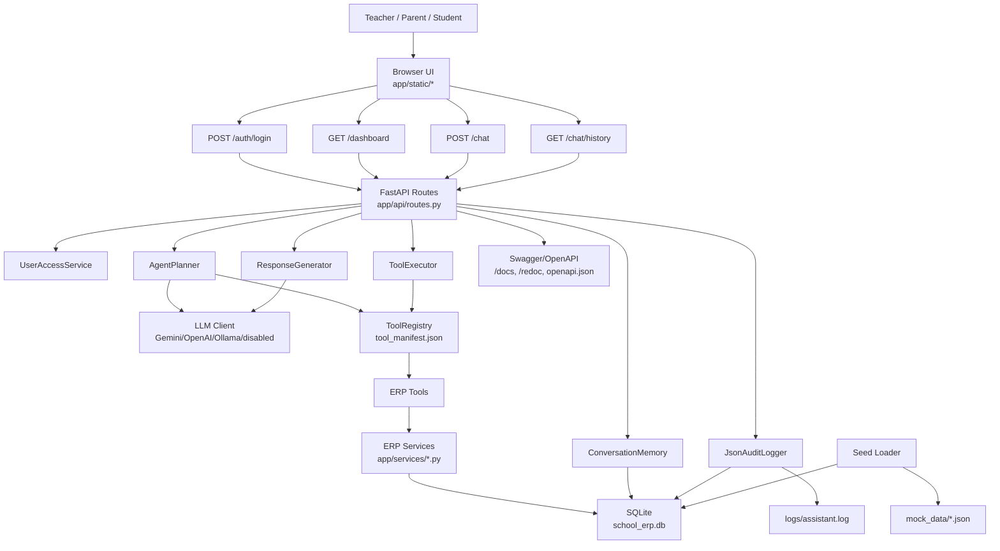

# AI School ERP Assistant - Architecture

An AI-powered School ERP assistant that lets teachers, parents, and students ask natural-language questions about attendance, marks, fee status, homework, and timetable data. The system is built with **FastAPI**, a browser-based **HTML/CSS/JavaScript UI**, **SQLite**, structured ERP tools, persisted chat memory, and a pluggable LLM layer supporting **Gemini**, **OpenAI**, **Ollama**, and deterministic fallback mode.

This document explains the complete architecture, component responsibilities, request flows, storage layout, configuration model, deployment topology, and extension points.

---

## Table of Contents

- [Architecture Goals](#architecture-goals)
- [Core Components](#core-components)
- [Tech Stack](#tech-stack)
- [High-Level Architecture](#high-level-architecture)
- [ERP Agent Pipeline Flow](#erp-agent-pipeline-flow)
- [Runtime Request Flows](#runtime-request-flows)
- [Component Details](#component-details)
- [Persistence Model](#persistence-model)
- [Configuration Model](#configuration-model)
- [Security and Privacy](#security-and-privacy)
- [Deployment Topology](#deployment-topology)
- [Known Limitations](#known-limitations)
- [Extension Points](#extension-points)
- [Complete Project Structure](#complete-project-structure)

---

## Architecture Goals

| Goal | Implementation |
|---|---|
| **Natural ERP questions** | Users ask normal questions such as "Show my attendance" or "What homework is due tomorrow?" through `POST /chat`. |
| **Required ERP tool coverage** | Attendance, marks, fees, homework, and timetable are implemented as first-class ERP tools. |
| **Transparent agent planning** | The assistant returns plan steps when `return_plan=true`, making selected tools visible. |
| **LLM flexibility** | Planning and response rewriting can use Gemini, OpenAI, Ollama, or deterministic fallback. |
| **No hardcoded answers** | Business records live in `mock_data/*.json`, seed into SQLite, and are queried through services. |
| **Role-aware access** | Teacher and parent/student logins are scoped through users, tokens, and `user_student_access`. |
| **Usable browser demo** | Static UI supports login, Home and Chat windows, chat history, output cards, and transcript download. |
| **Auditable history** | Conversations, chat messages, execution logs, and JSONL audit logs are persisted. |
| **API-first design** | The browser UI uses the same FastAPI endpoints exposed through Swagger, ReDoc, Postman, and REST examples. |
| **Deployment readiness** | Docker, Docker Compose, health checks, OpenAPI export, and automated tests are included. |

---

## Core Components

| Component | Location | Responsibility |
|---|---|---|
| **Browser UI** | `app/static/index.html`, `app/static/app.js`, `app/static/styles.css` | Login page, Home dashboard, Chat window, chat history, dynamic output cards, transcript download. |
| **FastAPI App** | `app/main.py` | Application creation, static-file serving, route mounting, startup database initialization, exception handlers. |
| **API Routes** | `app/api/routes.py` | Auth, dashboard, chat, history, tools, users, students, logs, readiness, and health endpoints. |
| **Pydantic Schemas** | `app/models/schemas.py` | Request and response contracts used by FastAPI and OpenAPI. |
| **LLM Clients** | `app/agents/llm.py` | Provider clients for Ollama, OpenAI, Gemini, and disabled mode. |
| **Agent Planner** | `app/agents/planner.py` | Converts a user message into one or more ERP tool steps using LLM planning or deterministic fallback. |
| **Tool Executor** | `app/agents/executor.py` | Runs selected tools and captures per-tool success or failure. |
| **Response Generator** | `app/agents/responder.py` | Builds structured UI responses and optionally asks the LLM for natural wording. |
| **Tool Registry** | `app/tools/registry.py` | Loads tool metadata and maps tool names to service runner functions. |
| **Tool Manifest** | `app/tools/tool_manifest.json` | Defines tool names, intents, keywords, descriptions, and examples for the planner. |
| **ERP Services** | `app/services/*.py` | SQLite-backed business logic for attendance, marks, fees, homework, timetable, users, reports, and logs. |
| **Conversation Memory** | `app/memory/store.py` | Persists conversations and chat messages, and provides recent context for follow-up questions. |
| **Database Layer** | `app/services/database.py` | SQLite schema creation, connections, sessions, reads, writes, and reset helpers. |
| **Seed Loader** | `app/utils/seed_db.py` | Loads mock ERP JSON records into SQLite. |
| **Config Layer** | `app/utils/config.py` | Reads runtime settings from environment variables. |
| **Audit Logger** | `app/utils/logger.py` | Writes chat execution events to JSONL and the `execution_logs` table. |

---

## Tech Stack

| Layer | Technology |
|---|---|
| **Frontend** | Static HTML, CSS, JavaScript served by FastAPI |
| **API Framework** | FastAPI + Uvicorn |
| **Runtime Database** | SQLite |
| **Seed Data** | JSON files under `mock_data/` |
| **LLM Providers** | Gemini REST API, OpenAI-compatible chat completions, Ollama generate API, disabled fallback |
| **Validation** | Pydantic models |
| **Logging** | JSONL file logs + SQLite execution log table |
| **API Contract** | FastAPI OpenAPI, Swagger UI, ReDoc, static `openapi.json` |
| **Testing** | Pytest + Ruff + coverage gate |
| **Containerization** | Docker + Docker Compose |

---

## High-Level Architecture

```text
+----------------------------------------------------------------------------------+
|                                  CLIENT LAYER                                     |
|                                                                                  |
|   Browser UI                         Swagger UI / ReDoc          REST Client      |
|   http://127.0.0.1:8000/             /docs, /redoc                Postman/curl     |
+----------------------------------------------+-----------------------------------+
                                               |
                                               | HTTP requests
                                               | X-ERP-Auth-Token: <token>
                                               v
+----------------------------------------------------------------------------------+
|                                  FASTAPI APP                                      |
|                                  app/main.py                                      |
|                                                                                  |
|   +-------------------------------+      +-------------------------------------+ |
|   | Static UI                     |      | Exception Handlers                  | |
|   | / and /static/*               |      | AppError / validation / unexpected  | |
|   +----------------+--------------+      +-------------------+-----------------+ |
|                    |                                     |                       |
|                    v                                     v                       |
|   +-------------------------------------------------------------------------+   |
|   | API Routes - app/api/routes.py                                           |   |
|   |                                                                         |   |
|   | POST /auth/login       GET /dashboard       POST /chat                  |   |
|   | GET  /chat/history     GET /tools           GET  /logs                  |   |
|   | GET  /readiness        GET /students        GET  /users                 |   |
|   +------+-------------+------------+-------------+-------------+------------+   |
|          |             |            |             |             |                |
|          v             v            v             v             v                |
|   +-------------+ +-------------+ +-------------+ +-------------+ +------------+ |
|   | User Access | | Conversation| | Agent       | | Tool        | | Audit      | |
|   | Service     | | Memory      | | Planner     | | Executor    | | Logger     | |
|   +------+------+ +------+------+ +------+------+ +------+------+ +------+-----+ |
|          |               |               |               |               |       |
+----------+---------------+---------------+---------------+---------------+-------+
           |               |               |               |               |
           v               v               v               v               v
+----------------------------------------------------------------------------------+
|                                  AGENT + TOOL LAYER                               |
|                                                                                  |
|   +-------------------------+       +------------------------------------------+ |
|   | LLM Clients             |<----->| Response Generator                       | |
|   | Ollama/OpenAI/Gemini/   |       | Natural final answer + fallback status   | |
|   | disabled                |       +------------------------------------------+ |
|   +------------+------------+                                                    |
|                |                                                                 |
|                v                                                                 |
|   +-------------------------+       +------------------------------------------+ |
|   | Tool Registry           |------>| ERP Tool Runners                         | |
|   | tool_manifest.json      |       | attendance, marks, fees, homework,       | |
|   | registry.py             |       | timetable, summary, recommendations,     | |
|   +------------+------------+       | insights, exam plan, parent report       | |
|                |                    +----------------------+-------------------+ |
+----------------+-------------------------------------------+----------------------+
                                                             |
                                                             v
+----------------------------------------------------------------------------------+
|                                  SERVICE + DATA LAYER                             |
|                                                                                  |
|   +-----------------------------+      +--------------------------------------+  |
|   | ERP Services                |----->| SQLite Database                       |  |
|   | app/services/*.py           |      | school_erp.db                         |  |
|   +-----------------------------+      | students, users, attendance, marks,   |  |
|                                        | fees, homework, timetable, memory,    |  |
|   +-----------------------------+      | execution_logs                        |  |
|   | Seed Loader                 |----->+--------------------------------------+  |
|   | app/utils/seed_db.py        |                                                 |
|   +-------------+---------------+      +--------------------------------------+  |
|                 |                      | logs/assistant.log                    |  |
|                 v                      | JSONL audit trail                     |  |
|   +-----------------------------+      +--------------------------------------+  |
|   | mock_data/*.json            |                                                 |
|   | Realistic demo ERP records  |                                                 |
|   +-----------------------------+                                                 |
+----------------------------------------------------------------------------------+
```

### Mermaid View



---

## ERP Agent Pipeline Flow

```text
Chat Message
  |
  |-- Browser UI sends POST /chat
  |     |
  |     |-- student_id
  |     |-- conversation_id, optional
  |     |-- message
  |     |-- return_plan
  |
  |-- FastAPI route
  |     |
  |     |-- Resolve X-ERP-Auth-Token or user_id
  |     |-- Verify student access
  |     |-- Load recent conversation context
  |
  |-- AgentPlanner
  |     |
  |     |-- Try configured LLM provider
  |     |-- Validate returned tool names against ToolRegistry
  |     |-- If LLM fails, use deterministic keyword/context fallback
  |
  |-- ToolExecutor
  |     |
  |     |-- Execute each PlanStep
  |     |-- Convert AppError or unexpected errors into tool-level error results
  |
  |-- ERP Tool Runner
  |     |
  |     |-- attendance_tool -> AttendanceService
  |     |-- marks_tool -> MarksService
  |     |-- fee_status_tool -> FeeService
  |     |-- homework_tool -> HomeworkService
  |     |-- timetable_tool -> TimetableService
  |     |-- bonus tools -> AcademicInsightService
  |
  |-- SQLite Services
  |     |
  |     |-- Query seeded ERP tables
  |     |-- Aggregate subject summaries, fee totals, attendance percentages, etc.
  |
  |-- ResponseGenerator
  |     |
  |     |-- Build structured fallback response
  |     |-- Compact tool data for LLM rewrite
  |     |-- Ask LLM for natural wording, if configured
  |     |-- Attach llm_generated and llm status metadata
  |
  |-- Persistence
  |     |
  |     |-- Save conversation message
  |     |-- Save plan JSON
  |     |-- Save tool results JSON
  |     |-- Save response JSON
  |     |-- Write execution log row and JSONL audit event
  |
  |-- Response
        |
        |-- conversation_id
        |-- intent
        |-- plan
        |-- tools_used
        |-- response
        |-- status
        |-- errors
```

```text
Login + Dashboard
  |
  |-- User selects Teacher or Parent / Student
  |
  |-- POST /auth/login
  |     |
  |     |-- UserAccessService checks role, user id, password hash, active status
  |     |-- Returns auth_token and accessible students
  |
  |-- GET /dashboard
        |
        |-- Requires token or user scope
        |-- Loads attendance this month
        |-- Loads subject-level marks summary
        |-- Loads fee status
        |-- Loads pending homework
        |-- Loads today's timetable
        |-- Returns metrics, charts, and recent items
```

---

## Runtime Request Flows

### Login Flow

| Step | Component | What Happens |
|---|---|---|
| 1 | Browser UI | User chooses Teacher or Parent / Student and submits credentials. |
| 2 | `POST /auth/login` | Route receives `login_type`, `user_id`, and `password`. |
| 3 | `UserAccessService` | Verifies active user, role compatibility, and SHA-256 password hash. |
| 4 | SQLite | Reads `users` and `user_student_access`. |
| 5 | API response | Returns `auth_token`, user profile, and accessible students. |
| 6 | Browser UI | Stores token in memory and opens the Home dashboard. |

### Dashboard Flow

| Step | Component | What Happens |
|---|---|---|
| 1 | Browser UI | Calls `GET /dashboard?student_id=S001` with `X-ERP-Auth-Token`. |
| 2 | API route | Resolves token and verifies student access. |
| 3 | Services | Attendance, marks, fees, homework, and timetable services query SQLite. |
| 4 | API response | Returns metrics, charts, recent homework/timetable, weak subjects, and strong subjects. |
| 5 | Browser UI | Renders metric cards, subject bars, fee trend, focus areas, and today's list. |

### Chat Flow

| Step | Component | What Happens |
|---|---|---|
| 1 | Browser UI | Sends the chat message to `POST /chat`. |
| 2 | API route | Resolves user/student, loads memory, builds registry and LLM client. |
| 3 | Agent planner | Selects one or more ERP tools using LLM or fallback planning. |
| 4 | Tool executor | Executes selected tools independently. |
| 5 | ERP services | Query SQLite and return structured data. |
| 6 | Response generator | Creates a structured response and optionally LLM-written message. |
| 7 | Memory + logger | Saves exchange and audit event. |
| 8 | Browser UI | Displays all output in the Chat section only; right side stays chat history only. |

### History Flow

| Step | Component | What Happens |
|---|---|---|
| 1 | Browser UI | Calls `GET /chat/history` for the selected student. |
| 2 | API route | Scopes results by auth token or user id. |
| 3 | `ConversationMemory` | Reads `chat_messages` ordered by creation time. |
| 4 | Browser UI | Shows clickable history entries in the right panel. |
| 5 | User click | Loads the selected user message and assistant output into the Chat section. |

---

## Component Details

### Browser UI

```text
app/static/index.html
app/static/app.js
app/static/styles.css
```

Responsibilities:

- Displays the landing/login page.
- Supports exactly two login types: Teacher and Parent / Student.
- Shows two main app windows: Home and Chat.
- Renders dashboard cards, subject progress, fee trend, timetable, and focus areas.
- Sends token-authenticated API requests.
- Displays all chat outputs inside the Chat section.
- Displays only clickable chat history on the right side.
- Supports quick prompt buttons and chat transcript download.
- Shows LLM status when available, such as Gemini used or fallback.

### FastAPI App

```text
app/main.py
```

Responsibilities:

- Creates the FastAPI application.
- Initializes the SQLite schema and seed data during lifespan startup.
- Serves the browser UI from `/`.
- Serves static assets from `/static`.
- Mounts all API routes.
- Handles application errors, validation errors, and unexpected errors consistently.

### API Routes

```text
app/api/routes.py
```

Endpoints:

| Endpoint | Purpose |
|---|---|
| `POST /auth/login` | Login as teacher or parent/student and receive an auth token. |
| `GET /health` | Return app, database, and LLM-provider status. |
| `GET /readiness` | Return assignment readiness, tool coverage, feature evidence, and table counts. |
| `GET /tools` | Return public ERP tool manifest. |
| `GET /students` | Return active students, optionally scoped by user or token. |
| `GET /users` | Return active demo users. |
| `GET /dashboard` | Return Home dashboard metrics and charts. |
| `POST /chat` | Main natural-language assistant endpoint. |
| `GET /chat/history` | Return persisted chat messages. |
| `GET /chat/conversations` | Return conversation summaries. |
| `GET /logs` | Return execution log entries. |

### Agent Planner

```text
app/agents/planner.py
```

Responsibilities:

- Receives the user message, selected student, recent context, and reference date.
- Loads available subjects from marks and timetable data.
- Sends a JSON-only planning prompt to the configured LLM.
- Validates all LLM-selected tool names against `ToolRegistry`.
- Falls back to deterministic keyword planning when the LLM is disabled or fails.
- Extracts arguments such as subject, period, target percentage, and days until exam.

### LLM Clients

```text
app/agents/llm.py
```

Providers:

| Provider | Behavior |
|---|---|
| `disabled` | Raises a controlled failure so planner/responder use deterministic fallback. |
| `ollama` | Calls local Ollama `/api/generate` with JSON response format. |
| `openai` | Calls OpenAI-compatible `/chat/completions` with JSON response format. |
| `gemini` | Calls Gemini `generateContent` with `responseMimeType=application/json`. |

### Tool Registry and ERP Tools

```text
app/tools/registry.py
app/tools/tool_manifest.json
```

The manifest describes tool names, intents, descriptions, keywords, and examples. The registry maps those tool names to runner functions.

| Tool | Service Source | Supported Questions |
|---|---|---|
| `attendance_tool` | `AttendanceService` | Attendance percentage, present/missed classes, month and semester filters. |
| `marks_tool` | `MarksService` | Subject marks, average score, highest subject, weak/strong subjects. |
| `fee_status_tool` | `FeeService` | Paid status, pending fees, unpaid records, payment history. |
| `homework_tool` | `HomeworkService` | Pending homework, today/tomorrow due dates, subject homework. |
| `timetable_tool` | `TimetableService` | Today/tomorrow timetable, first class, subject timing. |
| `academic_summary_tool` | `AcademicInsightService` | Combined marks, attendance, homework, and fee summary. |
| `recommendation_tool` | `AcademicInsightService` | Data-driven improvement suggestions. |
| `attendance_insight_tool` | `AcademicInsightService` | Target attendance calculations. |
| `exam_planner_tool` | `AcademicInsightService` | Study plan from marks and days remaining. |
| `parent_report_tool` | `AcademicInsightService` | Parent-facing progress report. |

### ERP Services

```text
app/services/
```

| Service | Responsibility |
|---|---|
| `attendance.py` | Filters attendance by period and subject, calculates present/missed classes and percentage. |
| `marks.py` | Loads exam-wise marks, aggregates subject summaries, average, highest/lowest, weak/strong subjects. |
| `fees.py` | Loads monthly fee records, pending amount, paid amount, current-month status, payment history. |
| `homework.py` | Filters assignments by class, section, period, status, and subject. |
| `timetable.py` | Filters timetable by day, subject, and first-class mode. |
| `academics.py` | Combines services for summary, recommendations, attendance insight, exam plan, and parent report. |
| `users.py` | Authenticates demo users and enforces student access. |
| `students.py` | Resolves active students and available subjects. |
| `audit_logs.py` | Reads persisted execution log entries. |
| `database.py` | Manages SQLite schema, sessions, queries, and table reset helpers. |

### Response Generator

```text
app/agents/responder.py
```

Responsibilities:

- Converts successful tool results into UI-friendly response sections.
- Keeps raw ERP data available while rendering subject summaries cleanly.
- Compacts large tool outputs before sending them to the LLM.
- Prevents the LLM from inventing ERP facts.
- Attaches `llm_generated`, provider, status, and sanitized provider error details.

---

## Persistence Model

```text
school-ai-assistant/
  school_erp.db
    SQLite runtime database

  mock_data/
    students.json
    users.json
    attendance.json
    marks.json
    fees.json
    homework.json
    timetable.json

  logs/
    assistant.log
      JSONL audit events
```

### SQLite Tables

#### `students`

| Column | Purpose |
|---|---|
| `student_id` | Primary student identifier. |
| `name` | Student display name. |
| `role` | Student role value. |
| `class_name` | Class/grade. |
| `section` | Section. |
| `guardian_name` | Parent/guardian display name. |
| `active` | Active/inactive flag. |

#### `users`

| Column | Purpose |
|---|---|
| `user_id` | Teacher or parent/student login ID. |
| `name` | User display name. |
| `role` | `teacher` or `student`. |
| `password_hash` | SHA-256 hash of seeded demo password. |
| `api_token` | Demo token used as `X-ERP-Auth-Token`. |
| `active` | Active/inactive flag. |

#### `user_student_access`

| Column | Purpose |
|---|---|
| `user_id` | User with access. |
| `student_id` | Accessible student. |

#### `attendance`

| Column | Purpose |
|---|---|
| `student_id` | Student reference. |
| `date` | Attendance date. |
| `subject` | Subject name. |
| `status` | `present` or `absent`. |

#### `marks`

| Column | Purpose |
|---|---|
| `student_id` | Student reference. |
| `subject` | Subject name. |
| `exam` | Exam name, such as Unit Test or Mid Term. |
| `term` | Academic term. |
| `score` | Marks obtained. |
| `max_score` | Maximum marks. |

#### `fees`

| Column | Purpose |
|---|---|
| `student_id` | Student reference. |
| `month` | Fee month. |
| `amount` | Billed amount. |
| `paid_amount` | Paid amount. |
| `status` | `paid`, `unpaid`, or similar status. |
| `paid_on` | Payment date when available. |

#### `homework`

| Column | Purpose |
|---|---|
| `class_name` | Class/grade. |
| `section` | Section. |
| `subject` | Subject name. |
| `title` | Assignment title. |
| `assigned_date` | Assigned date. |
| `due_date` | Due date. |
| `status` | Pending/completed status. |

#### `timetable`

| Column | Purpose |
|---|---|
| `class_name` | Class/grade. |
| `section` | Section. |
| `day_of_week` | Timetable day. |
| `period` | Period number. |
| `subject` | Subject name. |
| `start_time` | Class start time. |
| `end_time` | Class end time. |
| `teacher` | Teacher name. |

#### `conversations`

| Column | Purpose |
|---|---|
| `conversation_id` | Chat session ID. |
| `user_id` | Authenticated user when available. |
| `student_id` | Student context. |
| `role` | User role at chat time. |
| `created_at` | Creation timestamp. |
| `updated_at` | Last update timestamp. |

#### `chat_messages`

| Column | Purpose |
|---|---|
| `conversation_id` | Parent conversation. |
| `user_id` | Authenticated user when available. |
| `student_id` | Student context. |
| `role` | User role. |
| `message` | User message text. |
| `plan_json` | Planned tool steps. |
| `tool_results_json` | Tool execution results. |
| `response_json` | Final assistant response. |
| `created_at` | Message timestamp. |

#### `execution_logs`

| Column | Purpose |
|---|---|
| `conversation_id` | Related conversation. |
| `user_query` | Original user query. |
| `identified_intent` | Planned intent string. |
| `selected_tools_json` | Tools selected by the planner. |
| `execution_time_ms` | Tool execution duration. |
| `response_json` | Final response payload. |
| `status` | Success, partial success, or error. |
| `timestamp` | Log timestamp. |

---

## Configuration Model

Configuration is loaded from environment variables in `app/utils/config.py`.

| Variable | Default | Description |
|---|---|---|
| `DATABASE_URL` | `sqlite:///school_erp.db` | SQLite database URL. Only SQLite URLs are supported. |
| `LLM_PROVIDER` | `ollama` | Provider mode: `disabled`, `ollama`, `openai`, or `gemini`. |
| `LLM_TEMPERATURE` | `0` | Temperature passed to LLM providers. |
| `OLLAMA_BASE_URL` | `http://localhost:11434` | Ollama server base URL. |
| `OLLAMA_MODEL` | `llama3.1` | Ollama model name. |
| `OLLAMA_TIMEOUT_SECONDS` | `2` | Ollama request timeout. |
| `OPENAI_API_KEY` | empty | OpenAI API key. |
| `OPENAI_BASE_URL` | `https://api.openai.com/v1` | OpenAI-compatible base URL. |
| `OPENAI_MODEL` | `gpt-4o-mini` | OpenAI model name. |
| `OPENAI_TIMEOUT_SECONDS` | `10` | OpenAI request timeout. |
| `GEMINI_API_KEY` | empty | Gemini API key. |
| `GEMINI_BASE_URL` | `https://generativelanguage.googleapis.com/v1beta` | Gemini REST base URL. |
| `GEMINI_MODEL` | `gemini-2.5-flash` | Gemini model name. |
| `GEMINI_TIMEOUT_SECONDS` | `10` | Gemini request timeout. |
| `APP_TIMEZONE` | `Asia/Calcutta` | Timezone used for relative date filters. |
| `LOG_FILE_PATH` | `logs/assistant.log` | JSONL audit log path. |
| `MOCK_DATA_DIR` | `mock_data` | Seed data directory. |
| `AUTO_SEED` | `true` | Automatically seed SQLite on startup when empty. |

Provider examples:

```powershell
$env:LLM_PROVIDER = "disabled"
```

```powershell
$env:LLM_PROVIDER = "gemini"
$env:GEMINI_API_KEY = "your-private-key"
$env:GEMINI_MODEL = "gemini-2.5-flash"
```

---

## Security and Privacy

| Area | Current Behavior |
|---|---|
| **Login** | Demo users authenticate with seeded user IDs and password hashes. |
| **Token scope** | `X-ERP-Auth-Token` resolves to one ERP user and accessible students. |
| **Role access** | `UserAccessService` prevents users from accessing unassigned students. |
| **Provider keys** | API keys are read from environment variables; `.env.example` contains blank placeholders. |
| **LLM calls** | Tool results and user questions are sent to configured external providers only when enabled. |
| **Fallback mode** | `LLM_PROVIDER=disabled` avoids external LLM calls. |
| **Audit logs** | Queries, selected tools, execution time, and responses are stored for review. |
| **Mock data** | Demo ERP records are local JSON files seeded into SQLite. |

Production recommendations:

- Replace demo auth with real identity management.
- Store API keys in a secret manager or private environment, never in source control.
- Use HTTPS in deployed environments.
- Add user, teacher, class, and school ownership boundaries for multi-tenant use.
- Add rate limiting and request-size limits for public deployments.
- Review whether LLM providers may receive sensitive student data before enabling external providers.

---

## Deployment Topology

### Manual Local Run

```text
Terminal:
  cd school-ai-assistant
  python -m uvicorn app.main:app --host 127.0.0.1 --port 8000 --reload
```

Local URLs:

| Service | URL |
|---|---|
| Browser UI | `http://127.0.0.1:8000/` |
| Swagger Docs | `http://127.0.0.1:8000/docs` |
| ReDoc | `http://127.0.0.1:8000/redoc` |
| Raw OpenAPI | `http://127.0.0.1:8000/openapi.json` |
| Health | `http://127.0.0.1:8000/health` |

### Docker Compose

```text
+------------------------------+
| school-ai-assistant          |
| FastAPI + static browser UI  |
| Port 8000                    |
| LLM_PROVIDER from env        |
| DATABASE_URL=/data/...       |
+---------------+--------------+
                |
                v
+------------------------------+
| school_ai_data Docker volume |
| /data/school_erp.db          |
| /data/logs/assistant.log     |
+------------------------------+
```

Services:

| Service | Image Source | Port | Responsibility |
|---|---|---|---|
| `school-ai-assistant` | `Dockerfile` | `8000` | FastAPI backend and static UI. |
| `school_ai_data` | Docker volume | n/a | Persists SQLite database and logs. |

Docker command:

```powershell
docker compose up --build
```

The container defaults to `LLM_PROVIDER=disabled`, so it can run without external API keys.

---

## Known Limitations

| Limitation | Impact |
|---|---|
| Demo authentication | Suitable for local demos, not production identity management. |
| Single-school mock data | Current mock dataset models one main student and demo users. |
| SQLite persistence | Best for local or single-instance deployments. |
| Keyword fallback planner | Works for supported ERP questions but is less flexible than a live LLM. |
| External LLM privacy | Gemini/OpenAI/Ollama integrations require careful handling of student data. |
| Static frontend | No frontend build system or component framework; intentionally simple for evaluation. |
| No streaming chat | Responses are returned as complete JSON payloads. |

---

## Extension Points

| Improvement | Suggested Location |
|---|---|
| Add more ERP modules, such as library or transport | `app/tools/tool_manifest.json`, `app/tools/registry.py`, `app/services/` |
| Add more students/classes | `mock_data/*.json` and seed logic if new tables are needed |
| Replace SQLite with Postgres | `app/services/database.py` and service SQL queries |
| Add real authentication | `app/services/users.py`, `app/api/routes.py`, auth middleware/dependencies |
| Add role-specific dashboards | `app/static/app.js`, `app/api/routes.py` |
| Add streaming responses | `app/api/routes.py`, `app/agents/responder.py`, UI chat renderer |
| Add model/provider health checks | `app/agents/llm.py`, `/health` or `/readiness` |
| Add analytics reports | `app/services/academics.py` and new dashboard response fields |
| Add frontend framework | Replace or wrap `app/static/*` while keeping FastAPI endpoints stable |

---

## Complete Project Structure

```text
school-ai-assistant/
|-- .dockerignore
|-- .env.example
|-- .gitignore
|-- API_DOCUMENTATION.md
|-- ARCHITECTURE.md
|-- Dockerfile
|-- IMPLEMENTATION_STATUS.md
|-- README.md
|-- api_examples.http
|-- docker-compose.yml
|-- openapi.json
|-- postman_collection.json
|-- pyproject.toml
|-- requirements.txt
|-- school_erp.db
|-- app/
|   |-- __init__.py
|   |-- main.py
|   |-- agents/
|   |   |-- __init__.py
|   |   |-- executor.py
|   |   |-- llm.py
|   |   |-- planner.py
|   |   `-- responder.py
|   |-- api/
|   |   |-- __init__.py
|   |   `-- routes.py
|   |-- memory/
|   |   |-- __init__.py
|   |   `-- store.py
|   |-- models/
|   |   |-- __init__.py
|   |   `-- schemas.py
|   |-- services/
|   |   |-- __init__.py
|   |   |-- academics.py
|   |   |-- attendance.py
|   |   |-- audit_logs.py
|   |   |-- database.py
|   |   |-- fees.py
|   |   |-- homework.py
|   |   |-- marks.py
|   |   |-- students.py
|   |   |-- timetable.py
|   |   `-- users.py
|   |-- static/
|   |   |-- app.js
|   |   |-- index.html
|   |   |-- styles.css
|   |   `-- assets/
|   |       `-- login-campus.svg
|   |-- tools/
|   |   |-- __init__.py
|   |   |-- registry.py
|   |   `-- tool_manifest.json
|   `-- utils/
|       |-- __init__.py
|       |-- config.py
|       |-- dates.py
|       |-- errors.py
|       |-- logger.py
|       `-- seed_db.py
|-- logs/
|   `-- assistant.log
|-- mock_data/
|   |-- attendance.json
|   |-- fees.json
|   |-- homework.json
|   |-- marks.json
|   |-- students.json
|   |-- timetable.json
|   `-- users.json
|-- scripts/
|   |-- demo_requests.ps1
|   |-- export_openapi.py
|   `-- start_local_server.ps1
`-- tests/
    |-- conftest.py
    |-- test_api.py
    |-- test_bonus_features.py
    |-- test_config_and_seed.py
    |-- test_deployment_artifacts.py
    |-- test_error_and_failure_paths.py
    |-- test_llm_clients.py
    |-- test_llm_planning.py
    |-- test_local_demo_ui.py
    |-- test_logging_and_audit.py
    |-- test_mock_data.py
    |-- test_natural_language_search.py
    |-- test_planner.py
    |-- test_role_access.py
    `-- test_services_and_tools.py
```

Generated/cache folders such as `.pytest_cache/`, `.ruff_cache/`, `.test_tmp/`, and coverage files are development artifacts and are not part of the runtime design.
